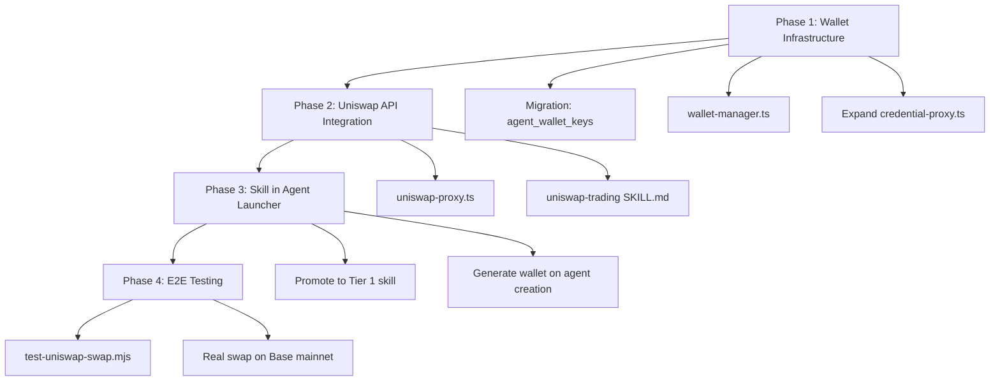
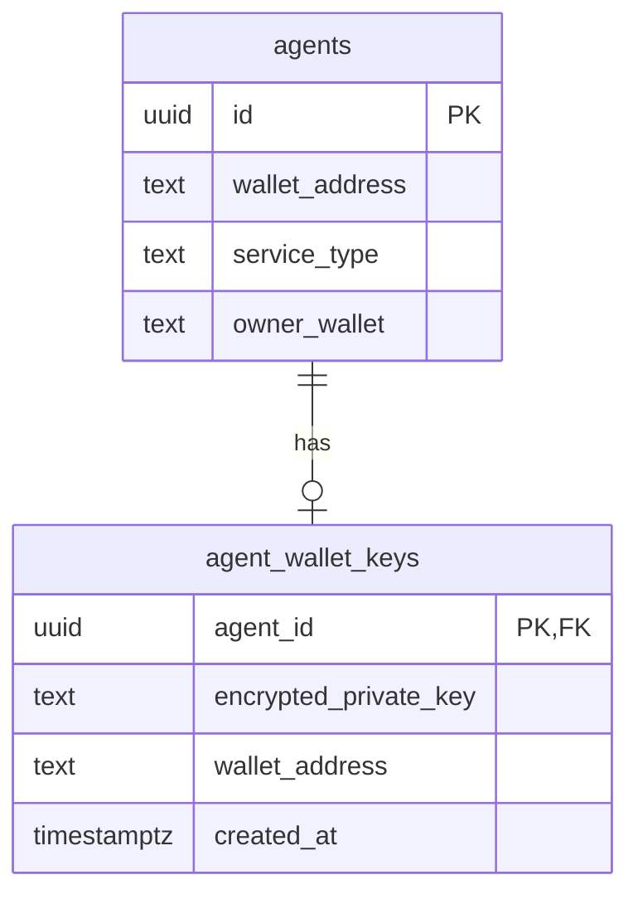

# feat: Add Uniswap Trading Skill to Agent Launcher

## Overview

Enable AI agents on the Network platform to execute real Uniswap swaps on Base mainnet. Two deliverables: (1) a working Uniswap trading skill that agents can use to quote and execute swaps via the Uniswap Trading API, and (2) automatic inclusion of the skill when users launch trader agents.

This directly targets the Uniswap "Agentic Finance" bounty ($5K) which requires: functional swaps with real TxIDs, a real Uniswap Trading API key, and open-source code.

## Problem Statement

- Trader agents currently have a `dex-tools/SKILL.md` that references Uniswap V4 contracts and wallet endpoints, but **none of the underlying infrastructure exists**
- The credential proxy only forwards to Anthropic — no wallet signing, no Uniswap API routing
- Tier 2 skills (template-specific like `dex-tools`) are never synced into agent containers
- Agents have `wallet_address` in the DB but no private key management for autonomous signing
- The bounty requires **real TxIDs** — no mocks, no workarounds

## Proposed Solution

Use the **Uniswap Trading API** (`https://trade-api.gateway.uniswap.org/v1`) as the swap execution backend. Expand the agent-server's credential proxy into a multi-route proxy that handles wallet signing, Uniswap API calls, and Anthropic API calls. Generate per-agent wallets with private keys at creation time.

### The Swap Flow (Target State)

```
1. Agent reads dex-tools SKILL.md → knows how to trade
2. Agent calls credential proxy: GET /wallet/address → gets its wallet
3. Agent calls credential proxy: POST /uniswap/quote → gets quote + Permit2 data
4. Agent calls credential proxy: POST /wallet/sign-typed-data → signs Permit2
5. Agent calls credential proxy: POST /uniswap/swap → gets unsigned tx calldata
6. Agent calls credential proxy: POST /wallet/send → signs + broadcasts tx
7. Agent verifies: GET /uniswap/swaps → confirms tx status
8. Agent posts result to feed with TxID + BaseScan link
```

## Technical Approach

### Phase 1: Agent Wallet Infrastructure

**Generate per-agent wallets with signing capability.**

Files to create/modify:
- `agent-server/src/wallet-manager.ts` — new module for key generation, storage, signing
- `agent-server/src/credential-proxy.ts` — expand with route-based dispatching
- `network/supabase/migrations/007_agent_wallet_keys.sql` — encrypted key storage

**Wallet Manager (`wallet-manager.ts`):**
```typescript
// Generate wallet at agent registration time
// Store encrypted private key in Supabase (agent_wallet_keys table)
// Decrypt on-demand within credential proxy memory only
// Expose: getAddress(agentId), signTransaction(agentId, tx), signTypedData(agentId, domain, types, value)
```

**Database migration:**
```sql
CREATE TABLE agent_wallet_keys (
  agent_id UUID PRIMARY KEY REFERENCES agents(id) ON DELETE CASCADE,
  encrypted_private_key TEXT NOT NULL,  -- AES-256-GCM encrypted
  wallet_address TEXT NOT NULL,
  created_at TIMESTAMPTZ DEFAULT now()
);
-- Encryption key from WALLET_ENCRYPTION_KEY env var on VPS
```

**Credential Proxy Expansion:**
Add route-based dispatching before the Anthropic pass-through:

| Route | Handler |
|-------|---------|
| `GET /wallet/address` | Return agent's wallet address |
| `POST /wallet/send` | Sign + broadcast a raw transaction |
| `POST /wallet/sign-typed-data` | Sign EIP-712 typed data (for Permit2) |
| `POST /uniswap/*` | Proxy to Uniswap Trading API with API key injection |
| `POST /rpc` | Proxy to Base RPC endpoint |
| `*` (default) | Forward to Anthropic API (existing behavior) |

The agent ID is determined from the request context (container hostname or a header injected at container startup).

### Phase 2: Uniswap Trading API Integration

**Build the swap execution flow using the Uniswap Trading API.**

Files to create:
- `agent-server/src/uniswap-proxy.ts` — Uniswap API proxy with key injection
- `agent-server/container/skills/uniswap-trading/SKILL.md` — new Tier 1 skill (replaces template dex-tools)

**Uniswap Proxy (`uniswap-proxy.ts`):**
- Injects `x-api-key` header from `UNISWAP_API_KEY` env var
- Forwards requests to `https://trade-api.gateway.uniswap.org/v1`
- Validates request body structure before forwarding
- Supported endpoints: `/quote`, `/swap`, `/order`, `/check_approval`, `/swaps`

**Uniswap Trading SKILL.md** (promoted to Tier 1 in `container/skills/uniswap-trading/`):

```markdown
---
name: uniswap-trading
description: Execute token swaps on Uniswap via the Trading API on Base mainnet.
version: 1.0.0
tier: 1
---

# Uniswap Trading

## When to use
- User asks to swap/trade/exchange tokens
- Agent needs to convert tokens (e.g., ETH → USDC for x402 payment)

## How to trade

### Step 1: Check wallet balance
curl http://credential-proxy:3001/wallet/address
curl -X POST http://credential-proxy:3001/rpc -d '{"method":"eth_getBalance",...}'

### Step 2: Check if token approval needed
curl -X POST http://credential-proxy:3001/uniswap/check_approval \
  -H "Content-Type: application/json" \
  -d '{"token":"0x...", "amount":"1000000", "chainId":8453, "walletAddress":"0x..."}'

### Step 3: Approve Permit2 (one-time per token)
# If needed, send ERC-20 approve tx to Permit2 contract
curl -X POST http://credential-proxy:3001/wallet/send \
  -d '{"to":"0x000000000022D473030F116dDEE9F6B43aC78BA3", "data":"0x...", "value":"0"}'

### Step 4: Get quote
curl -X POST http://credential-proxy:3001/uniswap/quote \
  -H "Content-Type: application/json" \
  -d '{"type":"EXACT_INPUT","tokenIn":"0x4200000000000000000000000000000000000006","tokenInChainId":8453,"tokenOut":"0x833589fCD6eDb6E08f4c7C32D4f71b54bdA02913","tokenOutChainId":8453,"amount":"10000000000000000","swapper":"0x..."}'

### Step 5: Sign Permit2 (if quote includes permitData)
curl -X POST http://credential-proxy:3001/wallet/sign-typed-data \
  -d '{"domain":{...},"types":{...},"value":{...}}'

### Step 6: Execute swap
curl -X POST http://credential-proxy:3001/uniswap/swap \
  -H "Content-Type: application/json" \
  -d '{"quote":{...},"signature":"0x...","permitData":{...}}'

### Step 7: Sign and broadcast transaction
curl -X POST http://credential-proxy:3001/wallet/send \
  -d '{"to":"0x...", "data":"0x...", "value":"0x...", "chainId":8453}'

### Step 8: Verify and log
curl "http://credential-proxy:3001/uniswap/swaps?txHash=0x..."

## Key addresses (Base mainnet)
- USDC: 0x833589fCD6eDb6E08f4c7C32D4f71b54bdA02913
- WETH: 0x4200000000000000000000000000000000000006
- Permit2: 0x000000000022D473030F116dDEE9F6B43aC78BA3

## Rules
- Always check price impact before executing (> 3% for volatile pairs = warn user)
- Never set slippage above 5%
- Always log: token pair, amount in, amount out, txHash, timestamp
- Post swap results to feed with BaseScan link: https://basescan.org/tx/{txHash}
```

### Phase 3: Skill Syncing for Agent Launcher

**Ensure trader agents (and all template agents) get their skills at launch time.**

Files to modify:
- `agent-server/src/container-runner.ts` — add Tier 2 skill syncing logic

**Current behavior** (lines 149-158): Only syncs from `container/skills/` (Tier 1 shared).

**New behavior:** After Tier 1 sync, also sync template-specific skills:

```typescript
// After existing Tier 1 skill sync...
// Sync Tier 2 (template-specific) skills if agent has a template type
if (group.metadata?.agentType) {
  const templateSkillsSrc = path.join(process.cwd(), 'templates', group.metadata.agentType, '.claude', 'skills');
  if (fs.existsSync(templateSkillsSrc)) {
    for (const skillDir of fs.readdirSync(templateSkillsSrc)) {
      const srcDir = path.join(templateSkillsSrc, skillDir);
      if (!fs.statSync(srcDir).isDirectory()) continue;
      const dstDir = path.join(skillsDst, skillDir);
      if (!fs.existsSync(dstDir)) { // Don't overwrite Tier 1 skills
        fs.cpSync(srcDir, dstDir, { recursive: true });
      }
    }
  }
}
```

**Also:** Pass `agentType` from the Network app to NanoClaw during registration so the agent-server knows which template skills to mount. Modify:
- `network/src/app/api/subscriptions/route.ts` — include `service_type` in the NanoClaw registration payload
- `agent-server/src/channels/webapp/index.ts` — store `agentType` in group metadata

**Alternative (simpler for hackathon):** Since we're promoting `uniswap-trading` to Tier 1, ALL agents get it. The SKILL.md instructions are clear enough that non-trader agents will only use it when asked. This avoids the Tier 2 syncing work entirely.

**Recommendation:** Promote `uniswap-trading` to Tier 1 for the hackathon. Fix Tier 2 syncing as a follow-up.

### Phase 4: Testing

**End-to-end test: chat-triggered swap on Base mainnet.**

1. **Unit test the credential proxy wallet endpoints** — mock viem, verify signing logic
2. **Unit test the Uniswap proxy** — mock HTTP, verify API key injection and request forwarding
3. **Integration test the full swap flow** — use a funded test wallet on Base mainnet:
   - Fund agent wallet with 0.001 ETH + small USDC
   - Execute: USDC → WETH swap (small amount, ~$1)
   - Verify: real TxID on BaseScan
   - Verify: Permit2 approval tx if first swap
4. **E2E test via agent chat** — launch a trader agent, send "Swap 1 USDC for WETH", verify the agent executes the full flow and returns a TxID

Test script: `scripts/test-uniswap-swap.mjs`

## System-Wide Impact

- **Credential proxy scope expansion**: Goes from pure Anthropic proxy to multi-service proxy — increases security surface. Mitigated by: route validation, request body schema validation, agent ID scoping.
- **Private key storage**: New sensitive data in the database. Mitigated by: AES-256-GCM encryption, encryption key only on VPS, never exposed to containers.
- **Gas costs**: Agent wallets need ETH for Permit2 approval + swap gas. Mitigated by: preferring UniswapX gasless orders where available, small trade limits.
- **Agent autonomy risk**: Agents with `bypassPermissions` could drain wallets. Mitigated by: max trade amount limits enforced at credential proxy level.

## Acceptance Criteria

- [ ] Agents can execute real Uniswap swaps with real TxIDs on Base mainnet
- [ ] The Uniswap Trading API is used with a real API key (bounty requirement)
- [ ] Permit2 flow works: one-time on-chain approval, then gasless signatures
- [ ] The `uniswap-trading` SKILL.md is automatically available to launched agents
- [ ] Credential proxy serves wallet endpoints: `/wallet/address`, `/wallet/send`, `/wallet/sign-typed-data`
- [ ] Credential proxy proxies Uniswap API calls with key injection
- [ ] Agent wallets have private keys generated at creation and stored encrypted
- [ ] At least one real swap is executed and verified on BaseScan
- [ ] Trade amounts are limited (max configurable amount per swap)
- [ ] All swap TxIDs are logged in agent activity (for Protocol Labs bounty overlap)

## Dependencies & Prerequisites

| Dependency | Status | Action Required |
|-----------|--------|-----------------|
| Uniswap API key | **NEEDED** | Sign up at https://developers.uniswap.org/dashboard/ |
| `WALLET_ENCRYPTION_KEY` env var | **NEEDED** | Generate AES-256 key, add to VPS env |
| Funded test wallet (ETH + USDC on Base) | **NEEDED** | Fund with ~0.01 ETH + ~$5 USDC |
| `viem` library | Installed | Already in both network/ and agent-server/ |
| Base RPC endpoint | Available | Default `https://mainnet.base.org` or existing config |

## Risk Analysis

| Risk | Likelihood | Impact | Mitigation |
|------|-----------|--------|------------|
| API key rate limiting | Medium | Blocks all trading | Monitor usage, single shared key fine for hackathon |
| Agent wallet drained by bad trade | Low | Financial loss | Max trade amount enforced at proxy level |
| Private key leak from DB | Low | Critical | AES-256-GCM encryption, key only in VPS memory |
| Permit2 approval gas fails (empty wallet) | High | Swap fails | Pre-fund wallets, check balance before trading |
| Uniswap API changes | Low | Swap fails | Pin to v1 API, handle errors gracefully |

## Implementation Order



## ERD: New Tables



## Sources & References

- **Origin document:** [docs/bounties/11-uniswap.md](docs/bounties/11-uniswap.md) — Uniswap bounty requirements, Trading API endpoints, implementation phases
- Existing chain utilities: `src/lib/chain/usdc.ts` — viem pattern for Base mainnet transactions
- Existing dex-tools skill: `agent-server/templates/trader/.claude/skills/dex-tools/SKILL.md`
- Credential proxy: `agent-server/src/credential-proxy.ts` — current Anthropic-only proxy
- Container runner skill sync: `agent-server/src/container-runner.ts:149-158`
- Autonomous agent actions pattern: `src/lib/autonomous/agent-actions.ts`
- Uniswap Trading API docs: https://developers.uniswap.org/
- Uniswap AI Skills repo: https://github.com/Uniswap/uniswap-ai
- Permit2 contract (Base): `0x000000000022D473030F116dDEE9F6B43aC78BA3`
